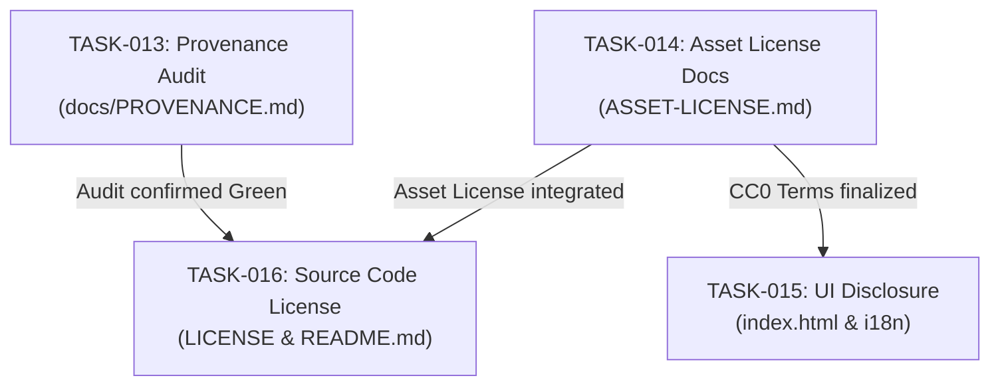

# Milestone 1: Licensing, Code Provenance, and Public Attribution

## 1. Objective
Establish complete legal certainty and transparency for ItemSeed prior to its itch.io release. This milestone addresses Sections 3, 4, and 5 of the itch.io Release Checklist (`docs/pm/ItemSeed_itch_release_adjustment_checklist.docx`), covering Code Provenance Auditing, Generated Assets Licensing (CC0 1.0), and Source Code License formalization.

## 2. Task Breakdown & Ownership

| Task ID | Task Title | Owner Role | Target Deliverables | Prerequisite |
| :--- | :--- | :--- | :--- | :--- |
| **[TASK-013](docs/pm/requirements/TASK-013-code-provenance-audit.md)** | GPL / Code Provenance Audit & Provenance Documentation | Project Manager | Git & codebase audit, audit classification (Green/Yellow/Red), `docs/PROVENANCE.md` | None |
| **[TASK-014](docs/pm/requirements/TASK-014-generated-assets-license.md)** | Generated Assets Licensing & Documentation (CC0 1.0) | Project Manager | Root `ASSET-LICENSE.md`, `README.md` asset section, itch.io copy | None |
| **[TASK-015](docs/pm/requirements/TASK-015-ui-asset-license-disclosure.md)** | UI & UX Asset License Disclosure and Export Metadata | Frontend Developer | `index.html` badge/notice, `i18n/` localization, responsive layout, test passing | TASK-014 |
| **[TASK-016](docs/pm/requirements/TASK-016-source-code-license-formalization.md)** | Source Code License Formalization & Repository Dual-License Alignment | Project Manager | Root `LICENSE`, `package.json` license field, dual-licensing section in `README.md` | TASK-013, TASK-014 |

## 3. Dependency & Execution Workflow

## 4. Current Status
- [x] Requirement specifications authored in `docs/pm/requirements/`.
- [x] [TASK-013] audit execution completed by Project Manager (`docs/PROVENANCE.md` published, GREEN rating).
- [x] [TASK-014] CC0 document authoring completed (`ASSET-LICENSE.md`, `README.md`, `docs/pm/itch-release-copy.md`).
- [x] [TASK-015] UI license disclosure implemented by Frontend Developer, reviewed, and transitioned to Done.
- [x] [TASK-016] source code license formalization completed (`LICENSE` with MIT, `package.json` synchronized, dual-license section in `README.md`). Milestone 1 complete!

